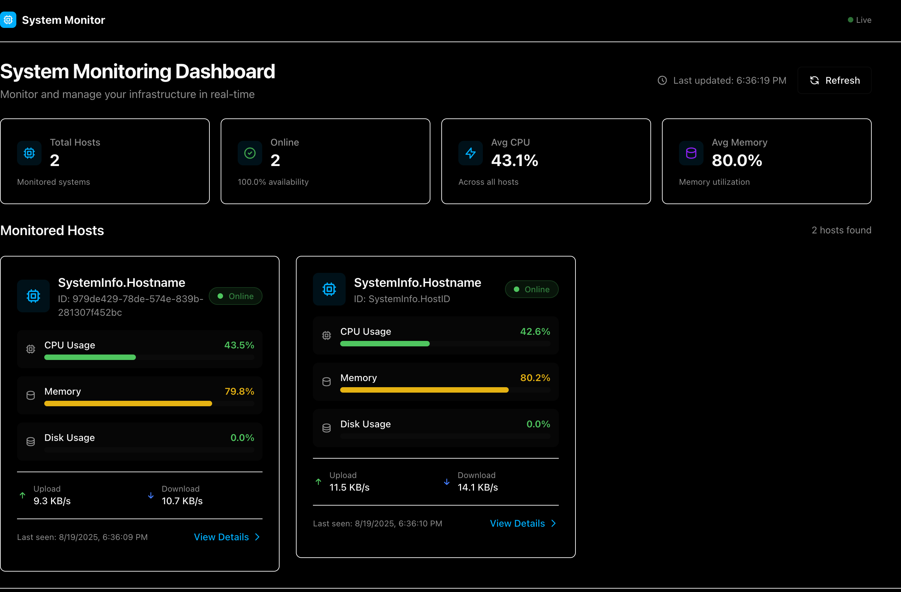
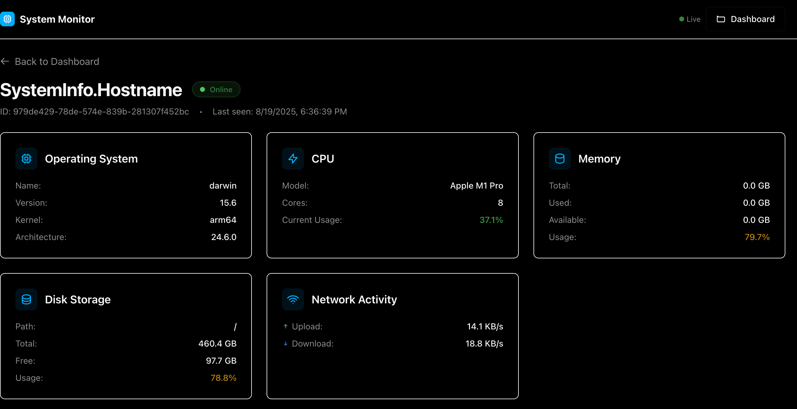
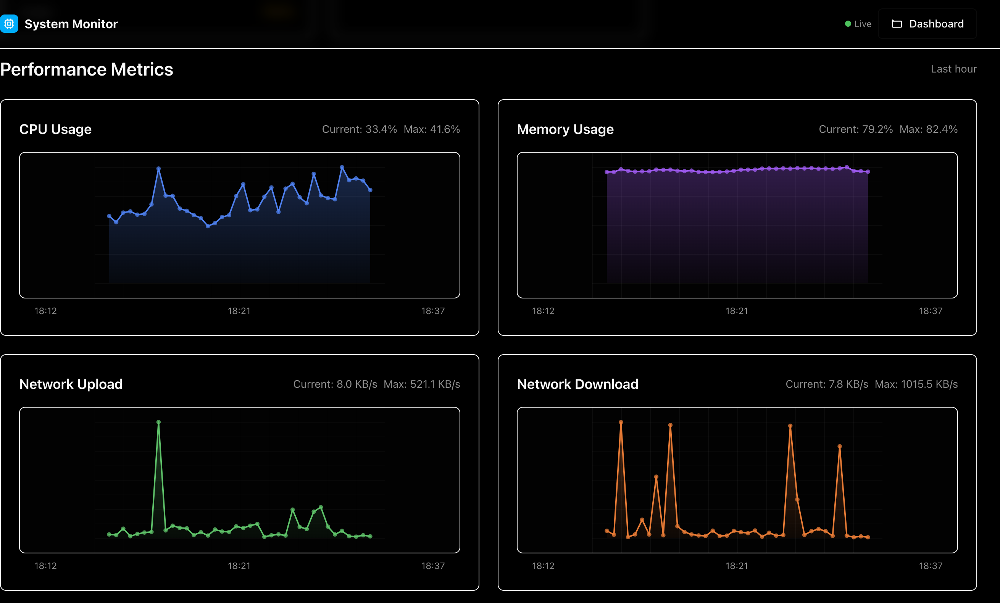
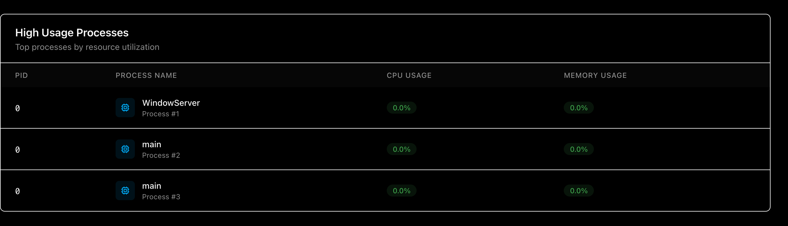

# System Stats Admin Panel

A modern React-based web admin panel for monitoring system statistics across multiple hosts. This application provides real-time visualization of system metrics with a sleek dark theme inspired by shadcn/ui design system.



## Features

### **Dashboard Overview**
- **Host Grid**: Visual cards displaying all monitored hosts with status indicators
- **Real-time Metrics**: Live CPU, memory, disk usage, and network activity
- **Status Monitoring**: Online/offline/warning states with color-coded indicators
- **Quick Stats**: Aggregated metrics across all hosts

### **Detailed Host Monitoring**
- **Performance Charts**: Interactive SVG charts showing historical data
- **System Information**: Comprehensive OS, CPU, memory, and disk details
- **Process Monitoring**: Real-time process list with resource usage
- **Network Activity**: Upload/download speeds with visual indicators



### **Modern UI/UX**
- **Dark Theme**: Professional shadcn/ui inspired design
- **Responsive Layout**: Mobile-first design with Tailwind CSS
- **Real-time Updates**: Automatic polling every 10 seconds
- **Smooth Animations**: Hover effects and transitions



### **Advanced Analytics**
- **Historical Data**: Time-series charts for performance trends
- **Resource Utilization**: Color-coded usage indicators
- **Process Insights**: Top resource-consuming processes
- **Network Monitoring**: Real-time bandwidth usage



## Tech Stack

- **Frontend Framework**: React 19 + TypeScript
- **Build Tool**: Vite 6 with hot reload
- **Styling**: Tailwind CSS 4 with custom design system
- **UI Components**: Custom shadcn/ui inspired components
- **Routing**: React Router DOM for SPA navigation
- **State Management**: React hooks with polling
- **Charts**: Custom SVG-based charts
- **Backend Integration**: REST API with Go backend

## Getting Started

### Prerequisites
- Node.js 18+ and npm
- Go backend server running on `http://localhost:8080`

### Installation

1. **Clone the repository**
   ```bash
   git clone <repository-url>
   cd system-stats-admin_panel
   ```

2. **Install dependencies**
   ```bash
   npm install
   ```

3. **Start development server**
   ```bash
   npm run dev
   ```
   The application will be available at `http://localhost:5173`

4. **Build for production**
   ```bash
   npm run build
   ```

5. **Preview production build**
   ```bash
   npm run preview
   ```

## 🏗️ Architecture

### Project Structure
```
src/
├── components/          # Reusable UI components
│   └── HostCard.tsx    # Host overview cards
├── pages/              # Route components
│   ├── DashboardOverviewPage.tsx
│   └── HostDetailPage.tsx
├── services/           # API integration
│   └── apiClient.ts    # HTTP client with error handling
├── types/              # TypeScript definitions
│   └── api.ts          # API response interfaces
├── hooks/              # Custom React hooks
│   └── useInterval.ts  # Polling hook
└── styles/
    └── index.css       # Global styles and theme
```

### Key Features
- **Real-time Polling**: Automatic data refresh using custom `useInterval` hook
- **Error Handling**: Comprehensive error states with retry functionality  
- **Type Safety**: Full TypeScript coverage matching Go backend models
- **Responsive Design**: Mobile-first approach with Tailwind CSS
- **Performance Optimized**: Efficient re-renders with React best practices

## 🎯 Usage

### Dashboard Navigation
1. **Main Dashboard**: View all monitored hosts at a glance
2. **Host Details**: Click any host card to view detailed metrics
3. **Real-time Data**: Metrics update automatically every 10 seconds
4. **Back Navigation**: Easy navigation between views

### API Integration
The frontend connects to a Go backend API at:
- Base URL: `http://localhost:8080/api/dashboard`
- Endpoints:
  - `GET /hosts/overview` - Host summary data
  - `GET /host/{id}/details` - Detailed host information
  - `GET /host/{id}/metrics/{metric}` - Historical metrics

## Development

### Available Scripts
- `npm run dev` - Start development server
- `npm run build` - Build for production
- `npm run preview` - Preview production build
- `npm run lint` - Run ESLint

### Code Style
- ESLint configuration for React and TypeScript
- Consistent component patterns and naming
- TypeScript strict mode enabled
- Tailwind CSS for all styling

## Contributing

1. Fork the repository
2. Create a feature branch (`git checkout -b feature/amazing-feature`)
3. Commit your changes (`git commit -m 'Add some amazing feature'`)
4. Push to the branch (`git push origin feature/amazing-feature`)
5. Open a Pull Request